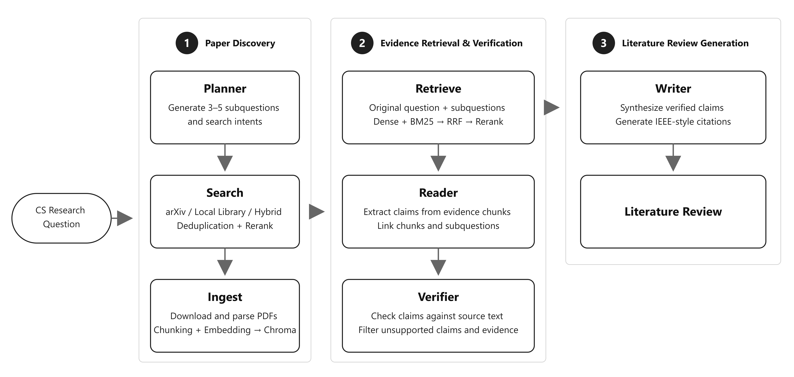

# ScholarTrace

An Evidence-Grounded Research Agent for Computer Science Literature Reviews

English | [简体中文](README.zh-CN.md)

**Want to get up to speed on a computer science topic without getting lost in a sea of papers?**

Give `ScholarTrace` a research question. It finds and filters relevant papers, retrieves and distills their key evidence, and produces a traceable literature review with citations.




## Contents

- [Overview](#overview)
- [Installation](#installation)
- [Quick Start](#quick-start)
- [Pipeline](#pipeline)
- [Tech Stack](#tech-stack)
- [Evaluation](#evaluation)
- [Additional Usage](#additional-usage)
- [Outputs](#outputs)


## Overview

ScholarTrace is a research agent for computer science literature. Given a natural-language research question, it produces a cited literature review in Markdown.

The workflow has three broad phases. First, it plans the question, searches for papers, reranks the results, downloads PDFs, and converts their text into embeddings. Next, it retrieves and reranks evidence passages around the original question and its subquestions. Finally, it extracts evidence-backed claims, verifies their support, and turns the verified findings into a literature review with IEEE-style references.

The project also includes a 30-question computer science benchmark. Paper search, evidence retrieval, claim generation, verification, and final report quality were evaluated separately; see [Evaluation](#evaluation) for the results.


## Installation

```powershell
uv sync --extra dev
Copy-Item .env.example .env
```

ScholarTrace uses Qwen models by default. Add your `DASHSCOPE_API_KEY` and `DASHSCOPE_WORKSPACE_ID` to `.env`; the remaining settings can be left at their defaults or adjusted as needed.

To use different models, update the corresponding model and endpoint settings in `.env`.


## Quick Start

Start the full research workflow by passing a question:

```powershell
uv run python -m scholar_trace "What are the main methods for evaluating retrieval-augmented generation systems?"
```

ScholarTrace will search for papers, download and parse PDFs, retrieve evidence, extract and verify claims, and generate the final report.

While the workflow runs, the terminal shows the active node, elapsed time, and a concise summary for each completed stage.

Literature reviews are saved under `outputs/reports/`. Intermediate state is stored in SQLite so interrupted runs can be resumed.

By default, papers come from arXiv. To use your own PDF library, see [Additional Usage](#additional-usage).

You can also restrict results by the year in which each paper was first uploaded to arXiv:

```powershell
uv run python -m scholar_trace `
  "What are the main methods for evaluating retrieval-augmented generation systems?" `
  --year-from 2020 `
  --year-to 2025
```


## Pipeline

ScholarTrace is implemented as a seven-node graph:

```text
Planner → Search → Ingest → Retrieve → Reader → Verifier → Writer
```

| Node | Input | What it does | Main output |
| --- | --- | --- | --- |
| **Planner** | Research question | Breaks the question into 3–5 focused subquestions for retrieval and writing, and creates 3–5 complementary search directions. | A research plan containing subquestions and search intents |
| **Search** | Research question, search intents, optional paper source, and year range | Converts each search intent into an arXiv-compatible query and retrieves 15 papers per query. It then uses Qwen3-Rerank to compare paper titles and abstracts against the original question, keeping the Top 20. See [Additional Usage](#additional-usage) for local-library modes. | Top 20 paper candidates |
| **Ingest** | Top 20 paper candidates | Processes candidates in ranked order until 10 papers have been downloaded and parsed successfully. Each PDF is split into chunks and embedded in Chroma; failed candidates are skipped. | Paper chunks and their embeddings |
| **Retrieve** | Original question, subquestions, and paper chunks | Runs Dense retrieval for semantic matches and BM25 for lexical matches over the original question and every subquestion. RRF fuses the result lists, and Qwen3-Rerank selects the Top 30 passages most relevant to the original question. | Top 30 evidence chunks |
| **Reader** | Original question, subquestions, and Top 30 evidence chunks | Extracts claims from the evidence and records both their source chunks and matching subquestions. If a subquestion has fewer than two claims, the Reader performs an additional targeted extraction pass. | Claims, cited evidence chunks, and subquestion mappings |
| **Verifier** | Reader claims and their cited chunks | Checks whether each claim is supported by its cited evidence, retaining only supported claims and the chunks that genuinely provide that support. | Verified claims and validated evidence chunks |
| **Writer** | Original question, subquestions, verified claims, validated evidence, and paper metadata | Synthesizes the verified findings into a literature review and formats the bibliography in IEEE style. | Markdown literature review |


## Tech Stack

- **Agent orchestration:** LangGraph, LangChain, SQLite Checkpointer
- **Models:** Qwen Chat, Qwen Embedding, Qwen3-Rerank
- **Paper acquisition and parsing:** arXiv API, PyPDF
- **Hybrid retrieval:** Chroma, Dense retrieval, BM25, RRF
- **Data and persistence:** Pydantic, SQLite


## Evaluation

### 30-Question Computer Science Benchmark

All experiments below use the same benchmark. Relevance and quality judgments were completed jointly by Codex and the project author.

- 30 research questions written in English;
- 7 areas: NLP, machine learning, computer vision, systems and networking, security and privacy, software engineering, and data management and information retrieval;
- Multiple question types, including surveys, comparisons, evaluations, limitations, and trends;
- Year constraints stored separately and interpreted as the first arXiv upload year;
- Questions available at [`evaluation/datasets/cs_questions.jsonl`](evaluation/datasets/cs_questions.jsonl), with the 30 generated reports under [`evaluation/reports`](evaluation/reports).


### 1. Planner: Subquestion Quality

We evaluated the 119 subquestions generated for the 30 benchmark questions, checking whether each subquestion was clear and useful and whether the complete set covered the original question.

| Metric | Description | Result |
| --- | --- | ---: |
| Valid Subquestions | Clear, distinct subquestions that are suitable for retrieval | 94.96% |
| Acceptable Subquestions | Useful for answering the original question, allowing minor redundancy or overly broad scope | 100.00% |
| Question Coverage | The complete subquestion set covers the main aspects required by the original question | 100.00% |


### 2. Search: Paper Relevance

This evaluation asks whether the papers returned by Search are worth downloading and reading. Judgments use only the research question, paper title, and abstract—not the full text.

Papers are labeled as:

- **Directly relevant:** the paper's main contribution directly helps answer the question;
- **Partially relevant:** the paper has a substantive connection and can provide background or supporting evidence;
- **Irrelevant:** the paper only shares keywords and does not meaningfully help answer the question.

Precision@K counts both directly and partially relevant papers.

| Paper ranking method | Direct | Partial | Irrelevant | Precision@5 | Precision@10 | Precision@20 |
| --- | ---: | ---: | ---: | ---: | ---: | ---: |
| RRF | 441 | 122 | 37 | 96.0% | 95.3% | 93.8% |
| **Qwen3-Rerank** | **497** | **85** | **18** | **99.3%** | **98.3%** | **97.0%** |

ScholarTrace uses Qwen3-Rerank for paper ranking in the final pipeline.


### 3. Retrieve: Evidence Retrieval Comparison

The Top 30 evidence chunks are labeled as directly relevant, partially relevant, or irrelevant. Precision@K counts both directly and partially relevant chunks, while Direct@K counts only directly relevant chunks.

| Method | Precision@5 | Precision@10 | Precision@20 | Direct@5 | Direct@10 | Direct@20 |
| --- | ---: | ---: | ---: | ---: | ---: | ---: |
| Dense + RRF | 84.0% | 80.3% | 82.0% | 78.0% | 75.0% | 76.7% |
| BM25 + RRF | 95.3% | 94.0% | 93.5% | 80.0% | 78.3% | 76.0% |
| Hybrid + RRF | 92.7% | 90.7% | 88.5% | 84.7% | 81.0% | 78.2% |
| **Hybrid + RRF + Qwen3-Rerank** | **96.7%** | **96.3%** | **94.5%** | **90.0%** | **90.0%** | **86.2%** |

The final pipeline uses Hybrid + RRF + Qwen3-Rerank.


### 4. Reader and Verifier

We annotated 661 claims generated across the 30 benchmark questions.

| Reader metric | Description | Result |
| --- | --- | ---: |
| Full Support | Every part of the claim is supported by its cited evidence | 91.5% |
| Partial Support | At least part of the claim is supported by its cited evidence | 99.5% |
| Direct Relevance | The claim directly helps answer the research question | 95.5% |
| Partial Relevance | The claim is at least partially relevant to the research question | 99.7% |
| Exact Mapping | The claim's subquestion labels are fully correct, with no missing or extra labels | 89.6% |
| Acceptable Mapping | The claim matches at least one assigned subquestion, allowing a small number of missing or extra labels | 97.1% |

| Verifier metric | Description | Result |
| --- | --- | ---: |
| Verified Full Support | Every part of a retained claim is supported by evidence | 91.8% |
| Verified Partial Support | At least part of a retained claim is supported by evidence | 99.5% |
| Exact Evidence Selection | Every retained evidence chunk is necessary and valid, with no omissions or redundancy | 86.2% |
| Acceptable Evidence Selection | The retained chunks support the claim, allowing minor redundancy | 99.4% |


### 5. Final Reports

We evaluated support, citations, and writing quality for 1,035 statements across the 30 generated reports.

| Metric | Result |
| --- | ---: |
| Fully Supported Statement Rate | 90.58% |
| Partially Supported Statement Rate | 8.93% |
| Unsupported Statement Rate | 0.49% |
| Citation Precision | 95.84% |
| Citation Completeness | 85.63% |

Writing quality was scored by Codex on a 1–5 scale:

| Dimension | Score |
| --- | ---: |
| Relevance | 4.53 |
| Organization | 5.00 |
| Synthesis | 3.93 |
| Non-redundancy | 3.97 |
| Caution and calibration | 4.30 |
| Readability | 4.97 |
| **Overall** | **4.45** |


## Additional Usage

**1. Choose a paper source**

ScholarTrace supports three source modes:

| Mode | Arguments | Description |
| --- | --- | --- |
| arXiv only | No additional arguments | Default mode. Searches for and downloads papers from arXiv. |
| Local library only | `--source library --library-path <path>` | Reads papers from a local PDF file or directory without searching arXiv. |
| Local library + arXiv | `--source hybrid --library-path <path>` | Loads local PDFs and supplements them with papers found on arXiv. |

`--library-path` may point to a single PDF or a directory. Directories are searched recursively for PDF files.

```powershell
# Local library only
uv run python -m scholar_trace "Research question" --source library --library-path "D:\papers"

# Local library and arXiv
uv run python -m scholar_trace "Research question" --source hybrid --library-path "D:\papers"
```

**2. Resume an interrupted run**

Every new run prints its `Run ID` in the terminal. Keep this ID if you may need to resume the run later.

**1) Resume from Evidence Chunks**

```powershell
uv run python -m scholar_trace --from-run <run_id>
```

**2) Resume from Raw Claims**

```powershell
uv run python -m scholar_trace --verify-from-run <run_id>
```


## Outputs

| Content | Default location |
| --- | --- |
| Literature review reports | `outputs/reports/` |
| Downloaded PDFs | `data/pdfs/` |
| Chroma collections | `data/chroma/<run-id>/` |
| Metadata, papers, chunks, and claims | `data/scholar_trace.db` |
| LangGraph checkpoints | `data/checkpoints.sqlite` |
| Public benchmark | `evaluation/datasets/cs_questions.jsonl` |
| 30 benchmark reports | `evaluation/reports/` |
